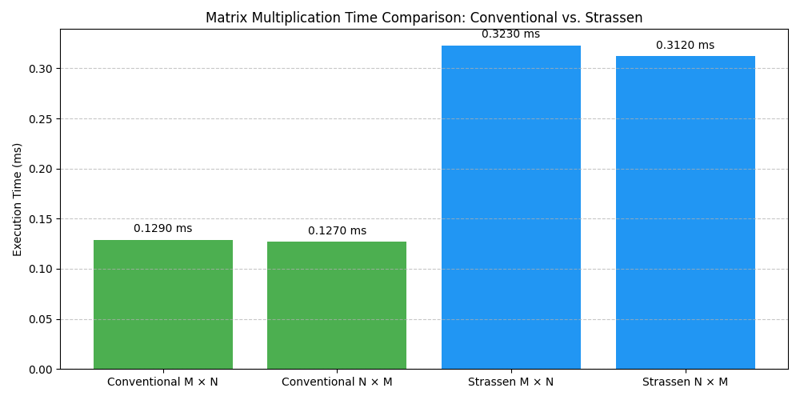

# Matrix Multiplication: Conventional vs. Strassen (Java, Maven)

This project compares two matrix multiplication strategies in Java:

1. ✅ **Conventional Matrix Multiplication** using `LU Decomposition` (via Apache Commons Math)
2. ✅ **Recursive Strassen's Algorithm**, manually implemented with padding and divide-and-conquer recursion
---

## ✅ Features

- Matrix inversion using LU Decomposition (`Apache Commons Math`)
- Conventional multiplication using `RealMatrix.multiply()`
- Identity verification: `M × N ≈ I`, `N × M ≈ I`
- Recursive Strassen’s algorithm with matrix splitting/merging
- Automatic matrix padding to next power-of-2
- Build with Maven for easy dependency management
- 🔍 **Bar chart visualization** using Python & Matplotlib:
    - Compare Conventional vs Strassen timings
    - Generates `matrix_multiplication_times.png` for reporting

---

## 📂 Project Structure

```bash
matrix-project/
├── pom.xml
└── src/
    ├── main/
    │   └── java/
    │       └── org/example/matrix/
    │           ├── ConventionalMatrix.java
    │           ├── StrassenMatrix.java
    │           └── MatrixLogger.java
    └── test/
        └── java/
            └── org/example/matrix/
                └── MatrixTest.java(Under Construction)

```

## 📦 Requirements
```
Java 8+ (JDK)
Maven 3.6+
```

## 🔧 Setup
1. Clone the repository
```
git clone https://github.com/your-username/matrix-project.git
cd matrix-project
```
2. Build the project using Maven
```
mvn clean compile
```
3. Run the application
```
mvn clean compile
mvn exec:java -Dexec.mainClass="org.example.matrix.ConventionalMatrix"
mvn exec:java -Dexec.mainClass="org.example.matrix.StrassenMatrix"
```
4. **View the results**: After running the above commands, 
the program will generate a bar chart `matrix_multiplication_comparison.png` in the 
project root directory, comparing the execution times of Conventional and 
Strassen's methods (multiplication step only).


Run `chart_matrix_times.py` to generate this chart using Python.


## Acknowledgements:
Apache Commons Math
IEEE 754 Floating-Point 
Arithmetic Strassen’s Algorithm

MIT © 2025